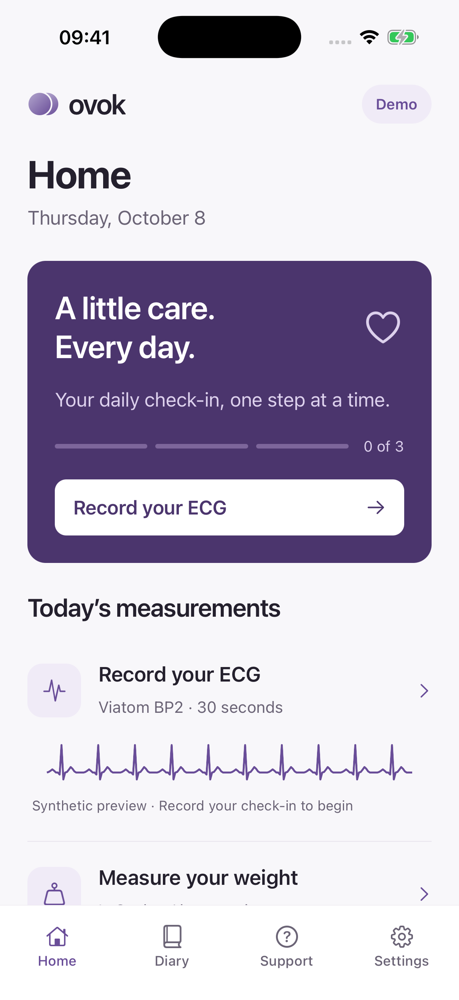
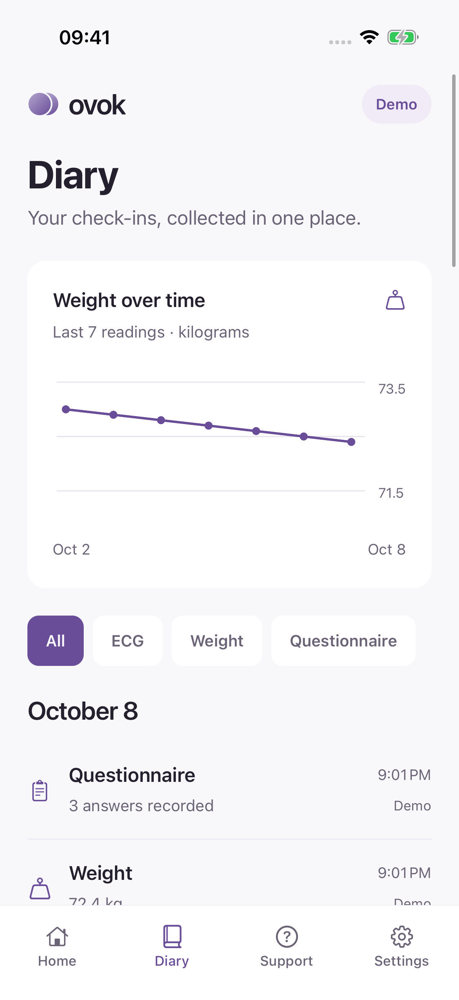
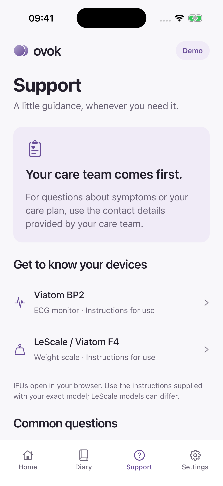
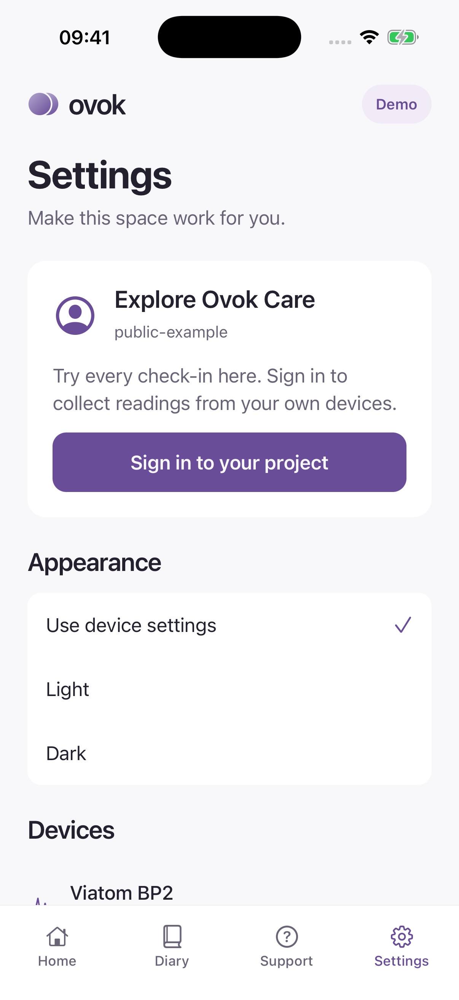

# Ovok Care

A small, thoughtfully designed CHF remote patient monitoring example built with **Expo, React Native, and Ovok**. Record an ECG, check your weight, and complete a daily symptom questionnaire. Four tabs keep the experience simple: **Home · Diary · Support · Settings**.

[Ovok](https://ovok.com) · [Official documentation](https://docs.ovok.com) · [Ovok Console](https://ovok.com/console) · [Repository](https://github.com/Ovok-Dev/rpm-mobile-app)

> Opens in **Demo** mode. All demo readings are synthetic, stay on your phone, and are never uploaded to a patient account.

<p>
  
  
  
  
</p>

| Tab      | What you can do                                                    |
| -------- | ------------------------------------------------------------------ |
| Home     | Complete today's ECG, weight, and three-question check-in.         |
| Diary    | Review saved readings, weight trends, ECG traces, and answers.     |
| Support  | Read device instructions and find measurement troubleshooting.     |
| Settings | Sign in to a patient account, pair devices, and choose appearance. |

## Start with the Ovok docs

**Read [docs.ovok.com](https://docs.ovok.com) before connecting a project or changing the integration.** This repository is a runnable example; the current docs explain the platform contract, account roles, permissions, and project configuration. Check the relevant guide and the declarations shipped with the installed SDK version rather than assuming an endpoint, device model, or setting works the same in every environment.

The app defaults to the **Ovok sandbox** at [`api.sandbox.ovok.com`](https://api.sandbox.ovok.com), with tenant code `public-example`. You can explore the entire demo without creating an account. Connecting patient authentication and server saves requires sandbox access and a patient account in the selected tenant.

## Run on an iPhone simulator

Requirements: Node.js 24+, Xcode with an installed iOS simulator, and CocoaPods. This project uses Expo SDK 57 and React Native 0.86; use a **development build**, not Expo Go.

Clone the example, then install and run it:

```sh
git clone https://github.com/Ovok-Dev/rpm-mobile-app.git
cd rpm-mobile-app
npm ci
npm run ios
```

Select an available iPhone when prompted. The first run generates the native project, installs its native dependencies, builds the app, and starts Metro.

For subsequent JavaScript development:

```sh
npm start
```

If Metro is already running on another port, build and start with the same port, for example `npx expo run:ios --port 8091`.

## Explore the demo

1. On **Home**, tap **Record your ECG** in the purple check-in panel.
2. Read the BP2 guidance, start the 30-second demo ECG, then save the recording.
3. Record a demo weight and answer the three daily questions.
4. Open **Diary** for the weight trend, filters, timestamps, waveforms, and answers.
5. Open **Support** for device IFUs and troubleshooting.
6. In **Settings**, try light/dark appearance or reset the demo history.

Seven days of synthetic history make the diary useful on first launch. Daily completion follows the phone's local calendar. Recordings survive app restarts.

## Create an Ovok account and set up the sandbox

1. **Create your Ovok account.** Start at [Ovok](https://ovok.com), then follow the [Get Started documentation](https://docs.ovok.com/#get-started) to [Ovok Console](https://ovok.com/console). Obtain access to a sandbox project; ask Ovok or your project administrator for access if you cannot create one.
2. **Choose your sandbox project.** Follow [the project configuration guide](https://docs.ovok.com/guides/chf-remote-monitoring/create-and-configure-the-ovok-project). Copy its tenant code. Use `public-example` only when you have access to that example tenant; a public code is an identifier, not a login credential.
3. **Have a project administrator configure access.** Follow [project setup](https://docs.ovok.com/authentication/project-setup) and [Access policies](https://docs.ovok.com/access-policies). Set `PATIENT_LOGIN_ENABLED` deliberately. Grant only the patient-scoped Patient, Observation, and QuestionnaireResponse operations this app requires. Questionnaire saves use updates with a stable resource ID. Confirm the [`transaction-bundles` feature](https://docs.ovok.com/settings-and-features/features/transaction-bundles) for atomic SDK measurement writes. Changing the feature list replaces the list, so preserve other enabled features.
4. **Create a sandbox patient account.** Use your project's approved [patient registration](https://docs.ovok.com/authentication/patient-registration) or [invitation](https://docs.ovok.com/invitations) flow. Self-registration needs the registration setting and a default Patient AccessPolicy. This app provides sign-in; it does not include a registration screen. Ask the project administrator for a test patient account if needed.
5. **Configure the app and sign in** using the steps below. Use synthetic test identities and readings while validating sandbox behavior.

Your developer/administrator account manages the project in Console. **The mobile app requires a Patient account** belonging to that tenant. A Console account or a ClientApplication secret cannot replace patient sign-in.

The docs currently link to `ovok.com/console`. When checked on 8 October 2026, that URL redirected to the Actimi platform page. If you see that page instead of Console, contact Ovok for the current account and sandbox access route.

### Configure this app

Both the runtime fallback and [.env.example](.env.example) use:

```dotenv
EXPO_PUBLIC_OVOK_BASE_URL=https://api.sandbox.ovok.com
EXPO_PUBLIC_TENANT_CODE=public-example
```

To use your own sandbox tenant:

```sh
cp .env.example .env
```

Edit `EXPO_PUBLIC_TENANT_CODE` in `.env`, keeping the sandbox API origin. The API origin and tenant must belong to the same environment. The base URL is the origin only; [src/ovok.ts](src/ovok.ts) configures `/fhir/R4/` separately. `.env` is ignored by Git. Restart Metro after changing environment values.

Every `EXPO_PUBLIC_` value is embedded in the app and is readable by users. These two values are public configuration. **Never add a client secret, admin token, patient password, or other credential to environment files used by the mobile app, source, screenshots, or examples.**

### Sign in and check a save

Use **Settings → Sign in to your project** with an existing patient account. The SDK performs tenant login using PKCE and handles the MFA continuation. No client secret belongs in the app or an `EXPO_PUBLIC_` variable.

Check the API origin displayed in the sign-in sheet. After signing in, complete a test questionnaire and verify its patient-scoped QuestionnaireResponse in your sandbox. Test device observations on a physical phone. A record marked **Needs sync** has been saved locally but has not completed its server save; use **Retry sync** and confirm the result. Signing in never uploads the demo history.

The example does not create accounts or change tenant settings automatically. Its text is bundled locally, so the guide's optional CMS/localisation setup is not required by this app.

### If setup does not work

| Symptom                                            | Check                                                                                                                                                                                                |
| -------------------------------------------------- | ---------------------------------------------------------------------------------------------------------------------------------------------------------------------------------------------------- |
| Sign-in fails                                      | API environment, tenant code, Patient account membership, `PATIENT_LOGIN_ENABLED`, and MFA if enrolled. Read [authentication troubleshooting](https://docs.ovok.com/authentication/troubleshooting). |
| Patient registration fails in your onboarding flow | Registration settings and the project's default Patient AccessPolicy. See [patient registration](https://docs.ovok.com/authentication/patient-registration).                                         |
| A record stays on Needs sync                       | Connectivity and the account's write permissions. Confirm the transaction feature for measurements and update permission for QuestionnaireResponse.                                                  |
| Devices are unavailable                            | Use a physical phone, sign in as a patient, allow Bluetooth, and check the exact model and IFU.                                                                                                      |
| The app still shows the previous tenant            | Restart Metro after editing `.env`; rebuild the development app if native dependencies changed.                                                                                                      |

## Physical devices and IFUs

Bluetooth requires a **physical phone**. The iOS simulator exercises the complete demo experience but cannot reproduce BLE device pairing.

| Device              | SDK declaration         | Used for                                    | IFU                                                                                                                           |
| ------------------- | ----------------------- | ------------------------------------------- | ----------------------------------------------------------------------------------------------------------------------------- |
| Viatom BP2          | `IntegratedDevices.BP2` | ECG waveform, duration, optional heart rate | [BP2 / Armfit instructions](https://storage.googleapis.com/public-assets-com-expo-app/instruction-pdf/instruction_armfit.pdf) |
| Viatom F4 / LeScale | `IntegratedDevices.F4`  | Body weight in kilograms                    | [Scale instructions](https://storage.googleapis.com/public-assets-com-expo-app/instruction-pdf/instruction_scales.pdf)        |

The IFU URLs are the links in the published [Ovok SDK device catalog](https://docs.ovok.com/native-sdk/guide/supported-devices), checked when this example was built. Read the IFU supplied with your exact device. **LeScale is a device family**; another model may need a different SDK declaration and IFU. Confirm the model before deploying to patients.

On a physical phone, sign in, allow Bluetooth access, power on your device, and open **Settings → Devices**. Select your own device. Pairing is explicit; the app reconnects only to remembered devices. Start measurements on the device and follow its IFU. The app receives normalized ECG or weight results and saves them through Ovok. BP2 blood pressure is outside this example's three-task scope.

## Data and failure handling

- Demo storage and patient storage are separate. Demo entries are rejected at the upload boundary.
- Patient diaries and login state use device keychain storage. Values are chunked with an atomic manifest swap; a failed write preserves the previous complete value. Storage uses `WHEN_UNLOCKED_THIS_DEVICE_ONLY` on iOS.
- A real reading is persisted on the phone **before** upload. Failed uploads remain marked **Needs sync**, with an explicit **Retry sync** action. SDK measurement saves use conditional creates, and questionnaire retries use the same FHIR resource ID.
- If local storage fails, received device readings remain in memory with **Retry save** on every tab. Keep the app open until they are saved; memory-held readings cannot survive an app termination.
- The diary shows records captured on this phone. It is not an all-device server history viewer.
- Sync runs in the foreground. This example does not provide background monitoring, unattended delivery, or guaranteed emergency response.
- Sign-out hides the patient diary; it retains pending records securely for the same account's next sign-in. Keep the app installed until pending records have synced.
- Clearing the app/device keychain can remove locally held records. Keychain cleanup, retention, managed devices, and patient handover need deployment-specific policies.

The three-question form is **illustrative**, not a validated CHF instrument. The app makes no diagnosis, scores no ECG rhythm, and sets no clinical alert threshold. A clinical team must approve the questionnaire, care plan, device suitability, escalation, and production workflow.

## Read the code

```text
App.tsx                 Four tabs and account boundary
src/Home.tsx            Today's three-task routine
src/MeasurementSheet.tsx Guided measurement and questionnaire flows
src/Diary.tsx           History, weight chart, recording details
src/Support.tsx         IFUs and troubleshooting
src/Settings.tsx        Appearance, devices, patient sign-in
src/model.ts            Record validation and local-day calculations
src/care-store.tsx      Persistence and explicit sync states
src/bluetooth.tsx       SDK allowlist, pairing, normalized results
src/device-readings.ts  Retain device readings until persistence succeeds
src/ovok.ts             Tenant client and FHIR saves
src/storage.ts          Demo storage and chunked keychain storage
src/theme.tsx, ui.tsx   Shared colors, type, controls and waveform
```

Native projects are generated by Expo and are excluded from Git. The app uses system typography, SF Symbols, safe areas, scalable text, large touch targets, reduced-motion handling, and light/dark palettes. Only the Bluetooth feature mounts the native SDK runtime, after patient sign-in on a physical phone.

The visual system and reusable patterns are recorded in [DESIGN.md](DESIGN.md). See [PRODUCT.md](PRODUCT.md) for scope and [CONTRIBUTING.md](CONTRIBUTING.md) for development, review, and acceptance steps. Coding assistants should read [AGENTS.md](AGENTS.md); [CLAUDE.md](CLAUDE.md) points Claude to the same project rules.

Development uses `dev` as the default branch. Keep work on feature branches and open pull requests against `dev`; `main` is reserved for reviewed stable updates. See the [branch workflow](CONTRIBUTING.md#branches-and-reviews).

## Checks

```sh
npm run typecheck
npm test
npx expo install --check
```

The small Node test suite checks date boundaries, daily completion, questionnaire validation, synthetic fixtures, persistence, corrupted input, and retrying device readings after local storage failures. The simulator smoke flow in `tests/simulator.yaml` runs with [Maestro](https://docs.maestro.dev/):

```sh
maestro test tests/simulator.yaml
```

Verification status and simulator captures are documented in [docs/verification.md](docs/verification.md). Physical device integration and patient authentication need their own hardware/account acceptance checks.

## Documentation

Use these official pages when setting up or extending the example:

| Link                                                                          | Why to read it                                                                                                                                      |
| ----------------------------------------------------------------------------- | --------------------------------------------------------------------------------------------------------------------------------------------------- |
| [Ovok](https://ovok.com)                                                      | Platform overview and the starting point for account access.                                                                                        |
| [Documentation home](https://docs.ovok.com)                                   | Current setup instructions and navigation to API references.                                                                                        |
| [Ovok Console](https://ovok.com/console)                                      | Project administration; confirm that your access is to the sandbox.                                                                                 |
| [RPM walkthrough](https://docs.ovok.com/guides/chf-remote-monitoring)         | Expo, authentication, device, and measurement integration examples. This repo adapts the ECG/weight routine and adds an illustrative questionnaire. |
| [Project setup](https://docs.ovok.com/authentication/project-setup)           | Tenant codes, login/registration settings, default policies, and prerequisites.                                                                     |
| [Tenant authentication](https://docs.ovok.com/authentication)                 | Patient and practitioner roles, PKCE, and MFA.                                                                                                      |
| [Access policies](https://docs.ovok.com/access-policies)                      | Patient and project permissions; read before changing data access.                                                                                  |
| [Settings and features](https://docs.ovok.com/settings-and-features)          | Configuration switches and their effects; settings do not grant resource permissions.                                                               |
| [Native SDK](https://docs.ovok.com/native-sdk)                                | Mobile SDK APIs and integration requirements; compare with the installed version.                                                                   |
| [Supported devices](https://docs.ovok.com/native-sdk/guide/supported-devices) | Exact model declarations and manufacturer instructions.                                                                                             |
| [FHIR R4 reference](https://docs.ovok.com/api/fhir/r4)                        | Resource fields and operations used for patient records.                                                                                            |
| [Working with AI agents](https://docs.ovok.com/working-with-ai-agents)        | How to give an assistant verified Ovok context and review its changes.                                                                              |

For an assistant, start with the [documentation router](https://docs.ovok.com/llms.txt), then load the relevant page's `/llms.txt`, such as [authentication Markdown](https://docs.ovok.com/authentication/llms.txt). Verify the current docs before making changes; generated code and a successful simulator run do not prove that project permissions or hardware integration are correct.

## License

Original app source: **AGPL-3.0-only**. See [LICENSE](LICENSE).

`@ovok/native` remains proprietary Actimi software, used here with the project owner's confirmed permission. Downstream SDK use and distribution require the applicable Actimi agreement; the app's AGPL license does not grant those rights. See [third-party notices](THIRD_PARTY_NOTICES.md).
